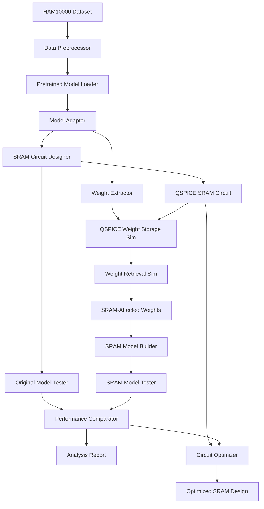

# Design Document: HAM10000 QSPICE Pipeline

## Overview

This system implements a complete pipeline from machine learning model training to hardware circuit analysis. The pipeline trains a convolutional neural network on the HAM10000 skin cancer dataset, designs an SRAM circuit in QSPICE to store model weights, simulates the storage/retrieval process to understand truncation effects, and compares the performance impact of circuit-level weight storage.

## Pipeline Workflow

### Phase 1: Data Preparation and Model Setup
```
HAM10000 Dataset → Data Preprocessing → Pre-trained Model Loading → Model Adaptation → Adapted Model (Full Precision)
```

**Step 1.1: Dataset Loading and Preprocessing**
- Load HAM10000 metadata and images
- Resize images to match pre-trained model input (e.g., 224x224 for ResNet/EfficientNet)
- Normalize pixel values using ImageNet statistics
- Encode diagnostic labels (dx) to numerical classes (7 classes)
- Create test set for evaluation

**Step 1.2: Pre-trained Model Loading and Adaptation**
- Load pre-trained model (e.g., ResNet50, EfficientNet, or existing HAM10000-trained model)
- Replace final classification layer for 7-class skin lesion classification
- Fine-tune on HAM10000 dataset (optional) or use existing HAM10000-trained weights
- Validate model performance on HAM10000 test set
- Save adapted model weights (full precision, typically float32)

**Output**: `adapted_model.pth` (full precision model ready for HAM10000 classification)

### Phase 2: SRAM Circuit Design in QSPICE
```
Circuit Requirements → SRAM Cell Design → Memory Array → Read/Write Interface
```

**Step 2.1: SRAM Cell Design**
- Design 6T or 8T SRAM cell in QSPICE
- Size transistors for stability and speed
- Simulate cell read/write operations
- Characterize noise margins and retention time

**Step 2.2: Memory Array Construction**
- Create addressable memory array from SRAM cells
- Design row/column decoders
- Implement sense amplifiers and write drivers
- Add address and control logic

**Step 2.3: Interface Design**
- Create digital-to-analog converters for weight storage
- Design analog-to-digital converters for weight retrieval
- Implement control signals for read/write operations
- Add timing and synchronization circuits

**Output**: `sram_circuit.qsch` (QSPICE schematic files)

### Phase 3: Weight Storage Simulation
```
Trained Weights → Format Conversion → QSPICE Simulation → Retrieved Weights
```

**Step 3.1: Weight Extraction and Formatting**
- Extract all model weights from trained model
- Convert weights to voltage/current levels for SRAM storage
- Create QSPICE-compatible input files for simulation

**Step 3.2: Storage Simulation**
- Run QSPICE simulation to store weights in SRAM circuit
- Simulate write operations for all weight values
- Allow circuit to settle and stabilize

**Step 3.3: Retrieval Simulation**
- Run QSPICE simulation to read weights back from SRAM
- Simulate read operations for all stored weights
- Convert analog outputs back to digital weight values

**Step 3.4: Weight Comparison**
- Compare original weights vs. retrieved weights
- Quantify truncation/quantization effects
- Analyze noise and distortion patterns

**Output**: `sram_weights.npy` (circuit-affected weights)

### Phase 4: Model Reconstruction and Performance Analysis
```
Original Model + SRAM Weights → SRAM Model → Performance Comparison → Analysis Report
```

**Step 4.1: SRAM Model Creation**
- Load original model architecture
- Replace original weights with SRAM-retrieved weights
- Validate model structure integrity

**Step 4.2: Performance Testing**
- Test original model on HAM10000 test set
- Test SRAM model on same test set
- Compute accuracy, precision, recall, F1-score for both

**Step 4.3: Comparative Analysis**
- Calculate performance degradation metrics
- Analyze which layers/weights are most affected
- Identify patterns in truncation effects

**Output**: `performance_report.pdf`, `comparison_plots.png`

### Phase 5: Circuit Optimization (Optional)
```
Performance Results → Circuit Parameter Analysis → Design Optimization → Improved Circuit
```

**Step 5.1: Parameter Sensitivity Analysis**
- Identify which SRAM circuit parameters most affect accuracy
- Vary transistor sizes, supply voltages, timing parameters
- Quantify trade-offs between circuit complexity and accuracy

**Step 5.2: Design Optimization**
- Optimize SRAM circuit for minimal accuracy loss
- Consider power consumption and area constraints
- Generate multiple design variants

**Output**: `optimized_sram.qsch`, `optimization_report.pdf`

## Architecture

### System Components



### Data Flow Architecture

**Input Data Flow:**
1. **Images**: HAM10000 images (JPEG) → Preprocessed tensors (224x224x3)
2. **Labels**: Diagnostic codes (dx) → One-hot encoded vectors
3. **Weights**: Model parameters (float32) → Voltage levels → Quantized weights

**Processing Pipeline:**
1. **ML Pipeline**: Data → Training → Model weights
2. **Circuit Pipeline**: Requirements → SRAM design → Simulation
3. **Integration Pipeline**: Weights + Circuit → Storage simulation → Performance analysis

## Components and Interfaces

### 1. Data Processing Components

**DataLoader**
```python
class HAM10000DataLoader:
    def load_metadata(self) -> pd.DataFrame
    def load_images(self, image_ids: List[str]) -> np.ndarray
    def preprocess_images(self, images: np.ndarray) -> torch.Tensor
    def create_splits(self, test_size: float = 0.2) -> Tuple[Dataset, Dataset, Dataset]
```

**ModelAdapter**
```python
class PretrainedModelAdapter:
    def load_pretrained_model(self, model_name: str = "resnet50") -> nn.Module
    def adapt_for_ham10000(self, model: nn.Module, num_classes: int = 7) -> nn.Module
    def fine_tune(self, model: nn.Module, train_loader: DataLoader, epochs: int = 5) -> nn.Module
    def evaluate(self, model: nn.Module, test_loader: DataLoader) -> Dict[str, float]
    def save_model(self, model: nn.Module, path: str)
```

### 2. Circuit Design Components

**SRAMDesigner**
```python
class QSPICESRAMDesigner:
    def design_sram_cell(self, cell_type: str = "6T") -> str  # Returns QSPICE netlist
    def create_memory_array(self, rows: int, cols: int) -> str
    def add_peripherals(self, array_netlist: str) -> str
    def simulate_circuit(self, netlist: str, test_vectors: List[float]) -> List[float]
```

### 3. Weight Storage Components

**WeightStorageSimulator**
```python
class WeightStorageSimulator:
    def extract_weights(self, model: nn.Module) -> np.ndarray
    def weights_to_voltages(self, weights: np.ndarray) -> List[float]
    def simulate_storage(self, voltages: List[float], sram_netlist: str) -> List[float]
    def voltages_to_weights(self, voltages: List[float]) -> np.ndarray
    def compare_weights(self, original: np.ndarray, retrieved: np.ndarray) -> Dict[str, float]
```

### 4. Analysis Components

**PerformanceAnalyzer**
```python
class ModelPerformanceAnalyzer:
    def create_sram_model(self, original_model: nn.Module, sram_weights: np.ndarray) -> nn.Module
    def test_model(self, model: nn.Module, test_loader: DataLoader) -> Dict[str, float]
    def compare_performance(self, original_metrics: Dict, sram_metrics: Dict) -> Dict[str, float]
    def generate_report(self, comparison: Dict) -> str
```

## Data Models

### Model Weight Structure
```python
@dataclass
class ModelWeights:
    layer_name: str
    original_weights: np.ndarray
    sram_weights: np.ndarray
    truncation_error: float
    snr_db: float
```

### Circuit Parameters
```python
@dataclass
class SRAMCircuitParams:
    cell_type: str  # "6T" or "8T"
    transistor_width: float  # in micrometers
    transistor_length: float  # in micrometers
    supply_voltage: float  # in volts
    word_line_voltage: float  # in volts
    bit_line_capacitance: float  # in farads
```

### Performance Metrics
```python
@dataclass
class PerformanceMetrics:
    accuracy: float
    precision: float
    recall: float
    f1_score: float
    confusion_matrix: np.ndarray
    per_class_accuracy: Dict[str, float]
```

### Comparison Results
```python
@dataclass
class ComparisonResults:
    original_metrics: PerformanceMetrics
    sram_metrics: PerformanceMetrics
    accuracy_degradation: float
    weight_truncation_stats: Dict[str, float]
    most_affected_layers: List[str]
```

## Error Handling

### Circuit Simulation Errors
- **Convergence failures**: Implement adaptive time steps and initial conditions
- **Memory overflow**: Use hierarchical simulation for large weight arrays
- **Netlist syntax errors**: Validate QSPICE files before simulation

### Model Training Errors
- **Overfitting**: Early stopping and regularization
- **Data loading errors**: Robust file handling and validation
- **Memory errors**: Batch size adjustment and gradient checkpointing

### Weight Storage Errors
- **Precision loss**: Monitor and report quantization effects
- **Circuit instability**: Validate SRAM operation before weight storage
- **Format conversion errors**: Robust data type handling

## Testing Strategy

The testing approach combines unit tests for individual components and property-based tests for system-wide correctness properties.

### Unit Testing
- Test data loading and preprocessing functions
- Validate model training convergence
- Verify QSPICE netlist generation
- Test weight extraction and conversion functions

### Property-Based Testing
Property-based tests will validate universal correctness properties using a minimum of 100 iterations per test. Each test will be tagged with the format: **Feature: ham10000-qspice-pipeline, Property {number}: {property_text}**

The testing framework will use Hypothesis for Python property-based testing, integrated with pytest for comprehensive test coverage.

## Correctness Properties

*A property is a characteristic or behavior that should hold true across all valid executions of a system-essentially, a formal statement about what the system should do. Properties serve as the bridge between human-readable specifications and machine-verifiable correctness guarantees.*

### Data Processing Properties

**Property 1: Metadata parsing completeness**
*For any* valid HAM10000 metadata file, parsing should extract all lesion classifications and patient information without data loss
**Validates: Requirements 1.1**

**Property 2: Image preprocessing consistency**
*For any* set of input images, preprocessing should produce images with identical dimensions and pixel values in the normalized range [0,1]
**Validates: Requirements 1.2**

**Property 3: Stratified split preservation**
*For any* dataset split operation, the class distribution in training, validation, and test sets should match the original dataset distribution within acceptable tolerance
**Validates: Requirements 1.3**

**Property 4: Data integrity preservation**
*For any* dataset with missing values, cleaning should either impute or exclude incomplete records while maintaining the total valid record count
**Validates: Requirements 1.4**

**Property 5: Label encoding consistency**
*For any* diagnostic category, the label encoder should always map the same category to the same numerical label across all encoding operations
**Validates: Requirements 1.5**

### Model Adaptation Properties

**Property 6: Pre-trained model loading**
*For any* supported pre-trained model architecture, loading should successfully restore all weights and model structure
**Validates: Requirements 2.1**

**Property 7: Classification layer adaptation**
*For any* pre-trained model, adapting the final layer should result in a model that outputs exactly 7 classes for HAM10000 classification
**Validates: Requirements 2.2**

**Property 8: Model performance validation**
*For any* adapted model, evaluation on HAM10000 test set should achieve accuracy above a minimum threshold (e.g., 70%)
**Validates: Requirements 2.4**

**Property 9: Weight format compatibility**
*For any* adapted model, saved weights should be extractable and compatible with the SRAM storage pipeline
**Validates: Requirements 2.5**

### Model Export Properties

**Property 11: Weight extraction completeness**
*For any* trained neural network, weight extraction should capture all model parameters without loss or corruption
**Validates: Requirements 3.1**

**Property 12: QSPICE format validity**
*For any* neural network conversion, the generated QSPICE netlist files should be syntactically valid and parseable by QSPICE
**Validates: Requirements 3.2**

**Property 13: Layer mapping consistency**
*For any* neural network layer type, the circuit generator should always map it to the same analog circuit representation
**Validates: Requirements 3.3**

**Property 14: File organization correctness**
*For any* export operation, all required QSPICE files should be created in the expected directory structure with correct naming
**Validates: Requirements 3.4**

**Property 15: Export validation thoroughness**
*For any* exported QSPICE files, validation should detect syntax errors and missing model components
**Validates: Requirements 3.5**

### Circuit Design Properties

**Property 16: SRAM cell structure validation**
*For any* SRAM cell design, the generated circuit should have the correct transistor count and connectivity for the specified cell type (6T or 8T)
**Validates: Requirements 4.1**

**Property 17: Memory array addressability**
*For any* memory array configuration, all SRAM cells should be properly addressable through row and column selection
**Validates: Requirements 4.2**

**Property 18: Read/write operation functionality**
*For any* test data written to SRAM circuit, the read operation should retrieve the same data within circuit precision limits
**Validates: Requirements 4.3**

**Property 19: Circuit simulation execution**
*For any* valid SRAM circuit netlist, QSPICE simulation should complete successfully and produce measurable outputs
**Validates: Requirements 4.4**

**Property 20: Performance characterization completeness**
*For any* SRAM circuit, characterization should measure and report precision, noise, and storage limitation metrics
**Validates: Requirements 4.5**

### Weight Storage Properties

**Property 21: Weight storage round-trip**
*For any* set of model weights, storing them in SRAM circuit and retrieving them should preserve the essential weight information within circuit precision limits
**Validates: Requirements 5.1, 5.2**

**Property 22: Weight comparison accuracy**
*For any* pair of weight sets (original and retrieved), the comparison should correctly compute and report all differences and error metrics
**Validates: Requirements 5.3**

**Property 23: Circuit effects quantification**
*For any* weight storage operation, the analysis should measure and report precision loss, noise, and distortion introduced by the SRAM circuit
**Validates: Requirements 5.4**

**Property 24: Model reconstruction integrity**
*For any* set of SRAM-retrieved weights, the reconstructed neural network should have identical architecture to the original model
**Validates: Requirements 5.5**

### Performance Analysis Properties

**Property 25: Comparative model evaluation**
*For any* original and SRAM model pair, both should be evaluated on identical test datasets using the same metrics
**Validates: Requirements 6.1, 6.2**

**Property 26: Performance difference computation**
*For any* pair of model evaluation results, the comparison should correctly compute accuracy differences and performance degradation metrics
**Validates: Requirements 6.3**

**Property 27: Visualization data integrity**
*For any* performance comparison data, generated plots should accurately represent the underlying metrics and degradation patterns
**Validates: Requirements 6.4**

**Property 28: Analysis report completeness**
*For any* SRAM circuit impact analysis, the generated report should document all required performance metrics and circuit effects
**Validates: Requirements 6.5**

### Circuit Optimization Properties

**Property 29: Parameter sensitivity identification**
*For any* SRAM circuit design space exploration, the analysis should correctly identify which parameters most significantly affect weight precision
**Validates: Requirements 7.1**

**Property 30: Optimization improvement validation**
*For any* circuit optimization suggestion, implementing the modification should result in measurable improvement in weight storage fidelity
**Validates: Requirements 7.2**

**Property 31: Design variation completeness**
*For any* set of SRAM circuit configurations, all variations should be properly simulated and their effects accurately compared
**Validates: Requirements 7.3**

**Property 32: Trade-off quantification accuracy**
*For any* circuit design analysis, the trade-off relationships between complexity, power consumption, and model accuracy should be correctly quantified
**Validates: Requirements 7.4**

**Property 33: Optimization documentation completeness**
*For any* circuit optimization process, the final report should document all tested configurations and identify optimal design parameters
**Validates: Requirements 7.5**

### Pipeline Automation Properties

**Property 34: Configuration loading completeness**
*For any* valid configuration file, all required pipeline parameters should be loaded and validated before execution
**Validates: Requirements 8.1**

**Property 35: Pipeline execution order**
*For any* pipeline run, all components should execute in the correct dependency order with proper error handling at each step
**Validates: Requirements 8.2**

**Property 36: Error handling effectiveness**
*For any* pipeline error condition, the error handler should provide informative messages and enable graceful recovery or termination
**Validates: Requirements 8.3**

**Property 37: Progress tracking accuracy**
*For any* long-running pipeline operation, progress updates should accurately reflect completion status and remaining work
**Validates: Requirements 8.4**

**Property 38: Results organization consistency**
*For any* completed pipeline run, all outputs should be organized in a clear, accessible directory structure with proper naming conventions
**Validates: Requirements 8.5**

## Error Handling

### Circuit Simulation Errors
- **Convergence failures**: Implement adaptive time steps and initial conditions
- **Memory overflow**: Use hierarchical simulation for large weight arrays
- **Netlist syntax errors**: Validate QSPICE files before simulation

### Model Training Errors
- **Overfitting**: Early stopping and regularization
- **Data loading errors**: Robust file handling and validation
- **Memory errors**: Batch size adjustment and gradient checkpointing

### Weight Storage Errors
- **Precision loss**: Monitor and report quantization effects
- **Circuit instability**: Validate SRAM operation before weight storage
- **Format conversion errors**: Robust data type handling

## Testing Strategy

The testing approach combines unit tests for individual components and property-based tests for system-wide correctness properties.

### Unit Testing
- Test data loading and preprocessing functions with specific HAM10000 samples
- Validate model training convergence with small synthetic datasets
- Verify QSPICE netlist generation with known circuit configurations
- Test weight extraction and conversion functions with sample models
- Test error conditions and edge cases for each component

### Property-Based Testing
Property-based tests will validate universal correctness properties using a minimum of 100 iterations per test. Each test will be tagged with the format: **Feature: ham10000-qspice-pipeline, Property {number}: {property_text}**

The testing framework will use Hypothesis for Python property-based testing, integrated with pytest for comprehensive test coverage.

**Property Test Configuration:**
- Minimum 100 iterations per property test
- Custom generators for HAM10000 data, model architectures, and circuit parameters
- Comprehensive input space coverage through randomization
- Integration with QSPICE simulation for circuit property validation

**Test Data Generators:**
- Random HAM10000-like datasets with controlled properties
- Random neural network architectures suitable for image classification
- Random SRAM circuit parameters within realistic ranges
- Random weight matrices with various precision levels

### Integration Testing
- End-to-end pipeline testing with real HAM10000 data
- QSPICE integration testing with actual circuit simulations
- Performance regression testing to ensure optimization improvements
- Cross-platform compatibility testing for different QSPICE versions